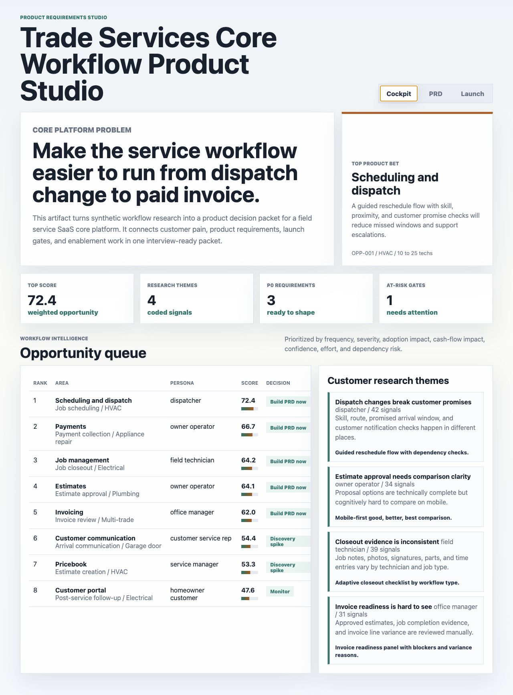
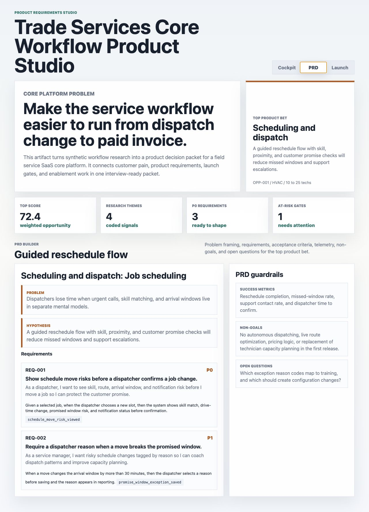
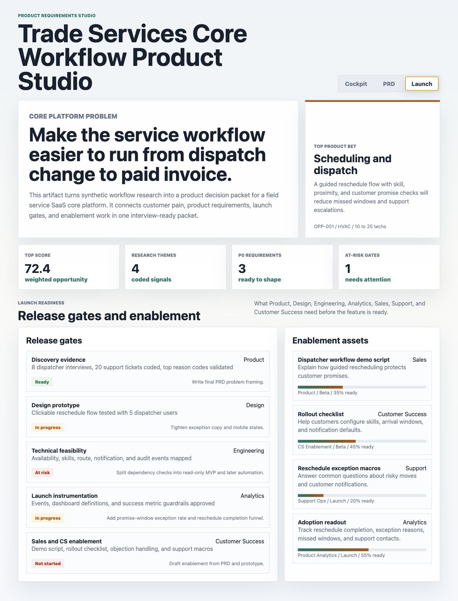

# Trade Services Core Workflow Product Studio

An interactive portfolio artifact for a Product Manager role on a field service SaaS core platform. The artifact models how a PM can move from workflow research to a prioritized product bet, PRD requirements, launch gates, and Sales or Customer Success enablement for trade businesses.

The product domain is field service management software for home and commercial service teams. The core workflow spans customer intake, scheduling and dispatch, estimate approval, job execution, invoice review, payment collection, and customer follow-up.

## Screenshots



Caption: The cockpit ranks core workflow opportunities by customer pain, adoption impact, cash-flow impact, confidence, effort, and dependency risk. It also shows coded research themes that explain why the top opportunity deserves a PRD.



Caption: The PRD surface converts the top scheduling and dispatch opportunity into problem framing, hypothesis, requirements, acceptance criteria, instrumentation events, success metrics, non-goals, and open questions.



Caption: The launch surface shows cross-functional gates and enablement assets needed before release, including discovery evidence, design testing, technical feasibility, analytics instrumentation, support readiness, and Customer Success rollout.

## What This Demonstrates

- Product discovery: translates customer pain themes into product opportunities.
- Prioritization: scores workflow bets with customer, business, confidence, effort, and dependency inputs.
- PRD writing: defines user stories, acceptance criteria, telemetry, success metrics, non-goals, and open questions.
- Cross-functional execution: connects Product, Design, Engineering, Analytics, Sales, Support, and Customer Success work before launch.
- Technical curiosity: names API and system concepts without pretending to build the production platform.

## Data

All data is synthetic and documented. No private company data, customer data, roadmap data, revenue data, support tickets, or production telemetry are used.

The synthetic data is modeled on public field service management workflow structure: scheduling and dispatch, estimates, job management, invoicing, payments, customer communication, pricebook quality, and customer portal follow-up. The generated rows represent realistic product discovery artifacts, not real company performance.

Files:

- `data/workflow_opportunities.csv`: eight core workflow opportunities across product areas, trade verticals, personas, workflow stages, pain points, hypotheses, scoring inputs, and decisions.
- `data/customer_research_themes.csv`: four coded research themes modeled as support tickets, onboarding notes, mock interviews, sales calls, and prototype feedback.
- `data/prd_requirements.csv`: PRD-ready requirements, user stories, acceptance criteria, API or system concepts, telemetry events, priorities, and statuses.
- `data/launch_gates.csv`: launch gates with owners, required evidence, status, risk, and next steps.
- `data/enablement_assets.csv`: Sales, Customer Success, Support, and Analytics enablement assets with readiness scores.
- `analysis/outputs/priority_queue.csv`: scored and ranked product opportunity queue.
- `analysis/outputs/summary.json`: summary metadata for the artifact.

Scoring assumptions:

- Benefit score weights: frequency 18%, severity 24%, adoption impact 22%, cash-flow impact 18%, and confidence 12%.
- Cost offsets: effort 11% and dependency risk 9%.
- Decisions are assigned from the final score: `Build PRD now`, `Discovery spike`, or `Monitor`.

## How To Run

```bash
npm run analyze
python3 -m http.server 4173
```

Open `http://localhost:4173`.

## Scope

This is a portfolio artifact, not a production field service management system. It does not schedule real technicians, send customer messages, process payments, integrate with accounting software, or claim to represent real business performance.

It does show how a Product Manager can evaluate core trade service workflows, choose a product bet, write PRD-ready requirements, plan launch gates, and prepare the cross-functional enablement needed to drive adoption.
